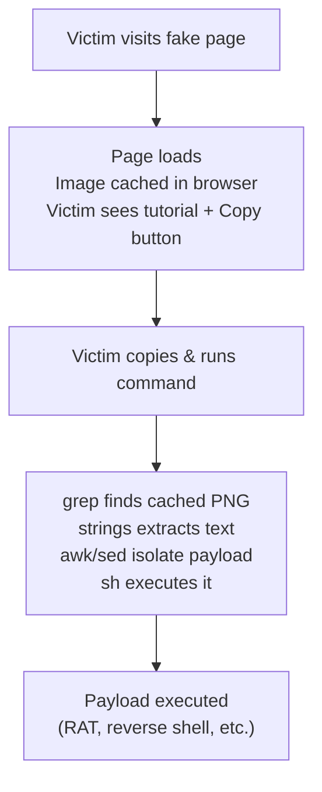

# ClickFix Browser Cache Attack (PoC)

> **DISCLAIMER:** This project is for **educational and authorized security research only**. Unauthorized use against systems you do not own or have explicit permission to test is illegal. The authors assume no liability for misuse.

## Overview

This PoC demonstrates a **ClickFix-style social engineering attack** that hides malicious shell code inside a PNG image served on a fake troubleshooting webpage. When a victim visits the page, the image is silently cached by their browser. The page then instructs the victim to run a terminal command to "fix their internet". The command extracts and executes the hidden payload from the browser's local cache.

No file is downloaded. No suspicious binary is executed. The payload lives entirely inside a cached image, retrieved through standard Unix tools (`grep`, `strings`, `awk`, `sed`, `sh`).

### Attack Chain



## How It Works

### 1. Payload Embedding (`embed_payload.py`)

The payload (`payload.sh`) is embedded into a PNG image's **tEXt metadata chunk**.not EXIF, not steganography. PNG tEXt chunks survive Firefox/Zen browser cache re-encoding, unlike EXIF which gets stripped.

```bash
python3 embed_payload.py [image.png]
```

| What it does | Detail |
|---|---|
| Reads `payload.sh` | Raw shell commands, no markers needed |
| Auto-prepends `#!/bin/sh` | If not already present |
| Auto-appends `exit #` | Stops execution, `#` comments out CRC bytes |
| Injects tEXt chunk | Keyword: `Z9k`. Unique fingerprint |
| Outputs `malicious_image.png` | Same directory as input |

### 2. Lure Page (`server.py`)

A Flask server serves a minimalist tutorial page titled **"Fix: No Internet on Linux"**. The page:

- Displays the weaponized image at the top (loads → cached)
- Shows a terminal command with a **Copy** button
- The command appears to reset DNS cache, but actually extracts the payload

The command text is constructed via JavaScript string concatenation so the fingerprint keyword (`tEXtZ9k`) never appears contiguously in the cached HTML source. Preventing the page itself from being a false positive during extraction.

## Clone:

```
git clone https://github.com/0xbitx/ClickFix_Browser_Cache_Attack_PoC.git
cd ClickFix_Browser_Cache_Attack_PoC
```


## Project Structure

```
ClickFix_Browser_Cache_Attack_PoC/
├── server.py              # Flask lure page (inline HTML, no templates/)
├── original_image.png     # Original Image
├── embed_payload.py       # python3 embed_payload.py [image.png]
├── payload.sh             # Your shell payload (raw commands)
└── requirements.txt       # flask, Pillow
```

## Usage

```bash
# 1. Install dependencies
python3 -m venv venv && ./venv/bin/pip install -r requirements.txt

# 2. Write your payload
echo 'whoami && id' > payload.sh

# 3. Embed payload into an image
python3 embed_payload.py my-screenshot.png   # or omit arg for auto-generated placeholder

# 4. Start the lure server
python3 server.py

# 5. Visit http://<ip>:8080 in a Firefox-based browser
#    Image caches → Copy command → Run in terminal
```

## Supported Browsers

| Browser | Cache Location | tEXt Survives? |
|---------|---------------|----------------|
| **Firefox** | `~/.cache/mozilla/firefox/*/cache2/entries/` | ✅ Yes |
| **Zen** | `~/.cache/zen/*/cache2/entries/` | ✅ Yes |
| **LibreWolf** | `~/.cache/librewolf/*/cache2/entries/` | ✅ Yes |
| **Tor Browser** | `~/.cache/torbrowser/*/cache2/entries/` | ✅ Yes |
| **Waterfox** | `~/.cache/waterfox/*/cache2/entries/` | ✅ Yes |
| Chrome / Brave / Edge | `~/.cache/*/Cache/Cache_Data/` | ❌ Strips tEXt |

> Chrome-based browsers re-encode cached images and strip tEXt chunks. Firefox-based browsers preserve the original file including metadata.

## Technical Details

### Why PNG tEXt instead of EXIF?

EXIF metadata is stripped by Firefox/Zen during cache re-encoding. PNG tEXt chunks are part of the PNG specification and are preserved because they're structurally part of the file format, not external metadata.

### Why `exit #` at the end?

The PNG tEXt chunk is followed by 4 CRC bytes in the binary. When `strings` extracts text, these CRC bytes may contain printable ASCII characters that leak into the output. Appending `exit #` ensures:

- `exit` terminates the shell before reaching garbage
- `#` comments out any CRC bytes that immediately follow (dash ignores everything after `#`)

### Why split the keyword in JavaScript?

The cached HTML page is also stored in the browser cache. If the extraction command's fingerprint (`tEXtZ9k`) appeared contiguously in the HTML source, `grep` would match the cached page as a false positive. Splitting it as `"tEX"+"tZ9k"` in JS keeps it contiguous in the DOM but fragmented in the cached source.

## Mitigation

- Never copy-paste terminal commands from websites without understanding them
- Be suspicious of "quick fix" tutorials that ask you to run commands
- Clear browser cache regularly
- Use browser profiles with restricted permissions for general browsing

## References

- [SOCRadar: DoubleCup ClickFix Loader](https://socradar.io/blog/doublecup-clickfix-loader-devicemanager-rats/)
- ClickFix social engineering technique: fake errors/CAPTCHAs trick users into pasting malicious commands

---

**FOR EDUCATIONAL AND AUTHORIZED SECURITY TESTING ONLY.**
